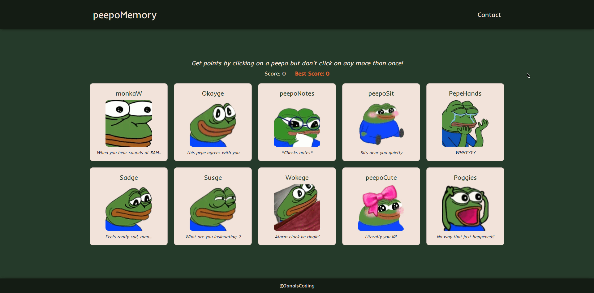

# Jana's Memory Card

## Project's Scope

- The scope of this project was to build **my second application in React using functional components and hooks**.
- This is a memory game that shuffles the pepes on every click, keeping score and best score based on each object's **isClicked** key.

## Live Demo



- See the full live preview [here](https://janaiscoding.github.io/memory-card/)

## Getting Started

### Installing and running

```
git clone https://github.com/janaiscoding/memory-card.git
cd memory-card
npm install
npm start
```

## Project Details & Description

- 10 beautiful pepes are ready to test your memory
- Click and remember which ones you've clicked before
- This project works thanks for the lifecycle methods and state inside of React.
- This project is part of The Odin Project's [curriculum](https://www.theodinproject.com/lessons/node-path-javascript-memory-card).

# Built with

## Technologies

- React
- CSS3
- HTML5

## Tools Used

- Visual Studio Code
- npm package manager
- Linux Terminal
- Git and Github

### Future plans for this project

- I could import a library and have more elements than the 10 images I manually uploaded to this project
- Mobile responsiveness
- Upload the project preview to this README
